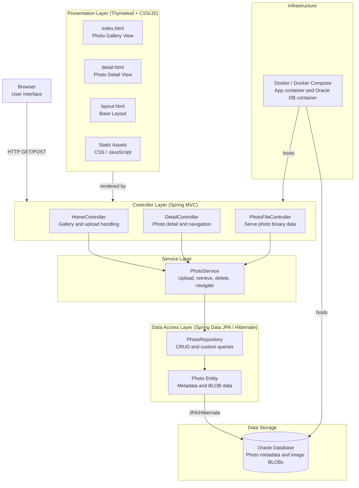

# Architecture Diagram

A Spring Boot 2.7 photo gallery application using Thymeleaf for server-side rendering, Spring Data JPA for data access, and Oracle Database for persistent storage of photo metadata and binary image data.

## Application Architecture

