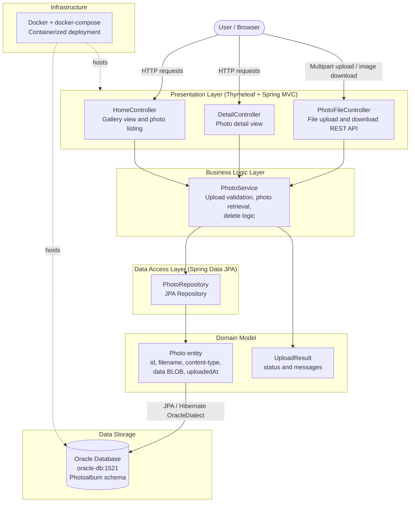

# Architecture Diagram

Photo Album is a Spring Boot web application that allows users to upload, view, and manage photos stored in an Oracle database.

## Application Architecture

```mermaid
flowchart TD
    User(["User / Browser"])

    subgraph Presentation["Presentation Layer (Thymeleaf + Spring MVC)"]
        HC["HomeController\nGallery view and photo listing"]
        DC["DetailController\nPhoto detail view"]
        PFC["PhotoFileController\nFile upload and download REST API"]
    end

    subgraph Business["Business Logic Layer"]
        PS["PhotoService\nUpload validation, photo retrieval,\ndelete logic"]
    end

    subgraph DataAccess["Data Access Layer (Spring Data JPA)"]
        PR["PhotoRepository\nJPA Repository"]
    end

    subgraph Model["Domain Model"]
        Photo["Photo entity\nid, filename, content-type,\ndata BLOB, uploadedAt"]
        UR["UploadResult\nstatus and messages"]
    end

    subgraph Storage["Data Storage"]
        OracleDB[("Oracle Database\noracle-db:1521\nPhotoalbum schema")]
    end

    subgraph Infrastructure["Infrastructure"]
        Docker["Docker + docker-compose\nContainerized deployment"]
    end

    User -->|"HTTP requests"| HC
    User -->|"HTTP requests"| DC
    User -->|"Multipart upload / image download"| PFC
    HC --> PS
    DC --> PS
    PFC --> PS
    PS --> PR
    PS --> UR
    PR --> Photo
    Photo -->|"JPA / Hibernate OracleDialect"| OracleDB
    Docker -.->|"hosts"| OracleDB
    Docker -.->|"hosts"| Presentation
```
