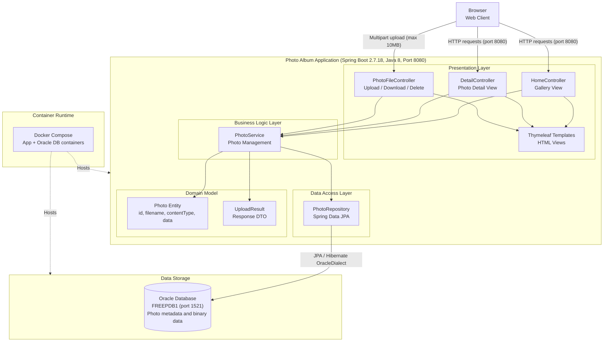

# Architecture Diagram

This diagram illustrates the high-level architecture of the Photo Album application, a Spring Boot web application for photo storage and gallery management backed by an Oracle database.

## Application Architecture

