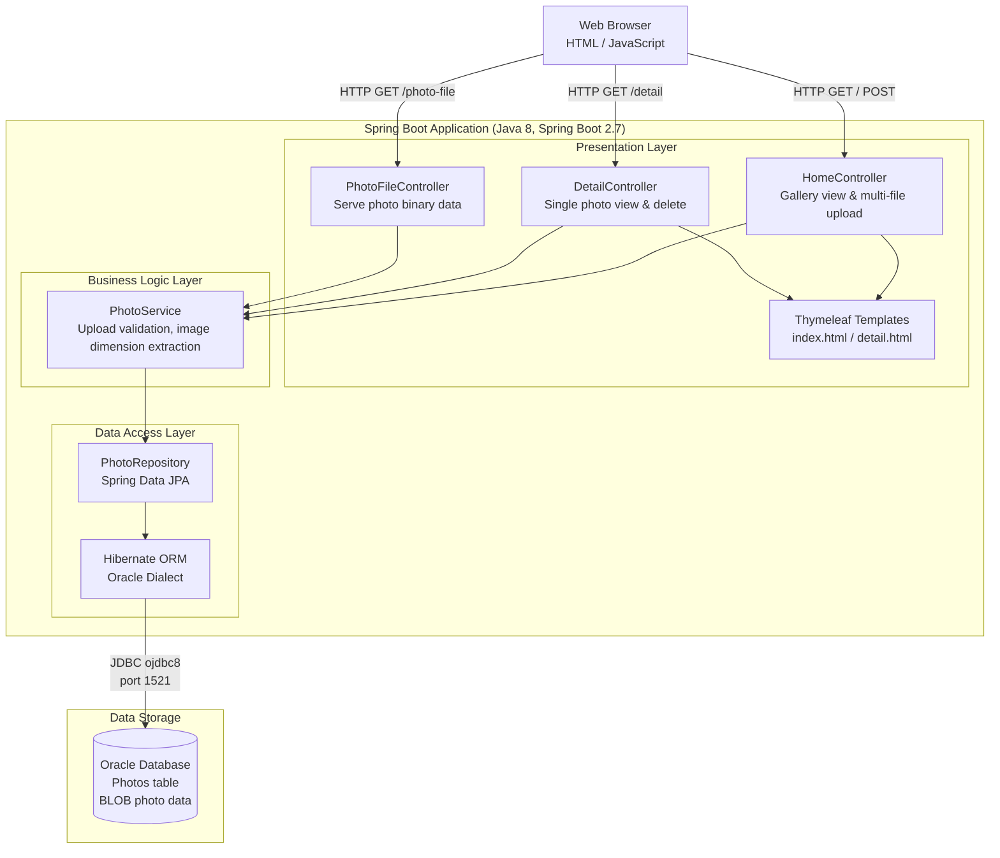

# Architecture Diagram

This diagram illustrates the current architecture of the Photo Album application, a Spring Boot web application that stores photos as binary data in an Oracle database.

## Application Architecture

